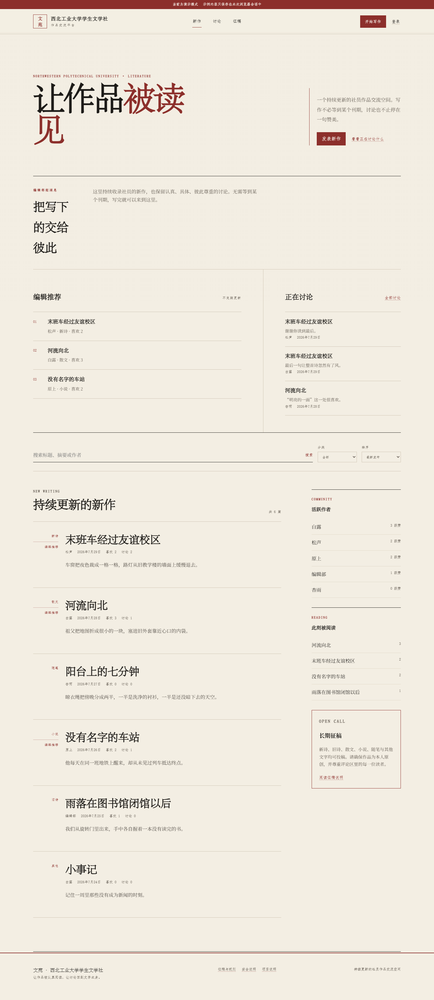
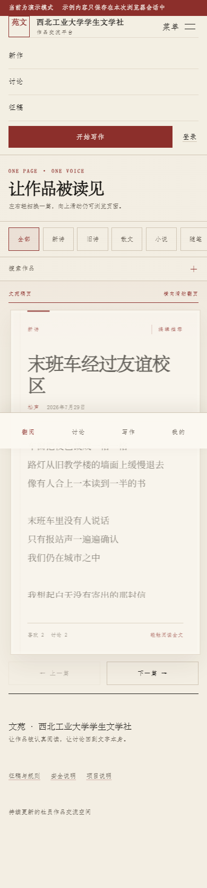
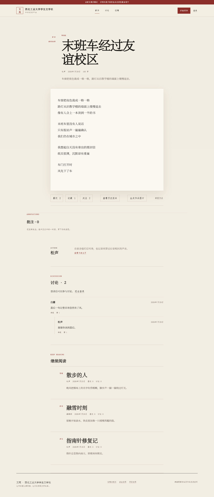

# 文苑 · 西北工业大学学生文学社作品交流平台

一个持续发布作品、持续产生评论与回复的文学社交平台。它采用现代中文文学出版物的排版气质，但不是季刊或电子杂志：没有刊期、封面作品和本期主题，首页核心是新作流、编辑推荐与正在讨论。



## 已完成功能

- 学号与密码注册、登录和退出。
- Supabase Auth 会话，不在业务表保存或查询登录密码。
- 发布和删除作品。
- 标题、摘要、正文和作者搜索（服务端全文检索）。
- 首页服务端分页浏览：每次返回 10 篇，桌面“再读十篇”继续加载；讨论页独立分页，不再逐篇补查。
- 新诗、旧诗、散文、小说、随笔与其他分类；旧“诗歌”数据会迁移为“新诗”。
- 最新、最多喜欢和最多讨论排序。
- 喜欢与取消喜欢。
- 评论、回复和软删除评论。
- 独立长文阅读页。
- 独立写作台和浏览器本地草稿。
- 作者主页与资料编辑（笔名每七天最多修改一次，简介可随时保存）。
- 普通成员与管理员权限区分。
- 管理员删除内容和维护编辑推荐。
- 桌面端、平板与移动端响应式布局；移动首页每次聚焦一张作品卡，左滑下一篇、右滑上一篇。
- 阅读页本地生成 1080 × 1920 PNG 作品图片，可分页后明确选择分享或保存。
- 找回邮箱的绑定、验证与更换，完整邮箱永不公开、不进入作者主页或作品。
- 忘记密码时通过验证码找回；对已知与未知学号返回相同文案，避免枚举。
- 未验证找回邮箱的账户在发布等写操作前被引导到账号安全页。
- 未配置 Supabase 时可直接运行的演示模式。

公开页面只展示笔名、简介、作品和互动数据，不展示学号。

## 项目结构

```text
.
├─ index.html
├─ assets/
│  ├─ styles.css
│  └─ student-literature-society-wordmark.png
├─ js/
│  ├─ app.js
│  ├─ config.mjs
│  ├─ config.example.mjs
│  ├─ data-service.mjs
│  ├─ demo-data.mjs
│  ├─ image-export.mjs
│  ├─ mobile-feed.mjs
│  └─ utils.mjs
├─ supabase/
│  ├─ config.toml
│  ├─ schema.sql
│  ├─ functions/
│  │  ├─ _shared/
│  │  ├─ account-email/
│  │  └─ password-recovery/
│  └─ migrations/
│     ├─ 20260731_split_poetry_categories_and_lock_pen_name.sql
│     ├─ 20260802_allow_weekly_pen_name_changes.sql
│     ├─ 20260802_account_recovery_security.sql
│     └─ 20260806_browse_works_and_discussions.sql
├─ tests/
│  ├─ browser-check.cjs
│  ├─ data-service.test.mjs
│  ├─ e2e-smoke.cjs
│  ├─ run-browser-check.cjs
│  ├─ schema.test.mjs
│  ├─ static-checks.mjs
│  ├─ static-server.cjs
│  └─ utils.test.mjs
├─ screenshots/
├─ SECURITY.md
└─ package.json
```

## 直接预览

项目默认使用演示模式，不需要数据库即可查看并操作全部主要功能。

需要 Node.js 20 或更高版本。进入项目目录后运行：

```bash
npm run serve
```

打开：

```text
http://127.0.0.1:4173
```

也可以使用常见的静态服务器：

```bash
python -m http.server 4173
```

不要直接双击 `index.html` 使用 `file://` 打开；浏览器会限制 ES Modules。

### 演示账户

这些账户只存在于 `demo-data.mjs`，用于本地展示和自动化测试：

| 权限 | 学号 | 密码 | 笔名 |
|---|---|---|---|
| 普通成员 | `2023123456` | `wenyuan88` | 松声 |
| 管理员 | `2023000001` | `editor88` | 编辑部 |

演示模式的数据只保存在当前页面的内存中，刷新后恢复示例状态；写作台草稿保存在当前浏览器的 `localStorage`。

## 连接全新的 Supabase

### 1. 创建项目

在 Supabase 新建项目，不要沿用保存过明文登录凭据的旧表。

在 Authentication → Providers 中启用 Email。当前“学号登录”实现会将学号转换为：

```text
20XXXXXXXX@accounts.wenyuan.invalid
```

因此需要关闭 Email confirmation，否则这种内部标识无法接收确认邮件。这个方案解决了明文登录凭据问题，但不提供身份核验和找回功能；正式对外开放前应阅读本文末尾的安全清单。

### 2. 初始化表和 RLS

在 Supabase SQL Editor 中完整执行：

```text
supabase/schema.sql
```

该脚本创建：

- `profiles`
- `works`
- `likes`
- `comments`
- `site_settings`
- Auth 新用户资料触发器
- 评论父子关系校验触发器
- 软删除评论 RPC
- 编辑推荐 RPC
- 全部 Row Level Security 策略

业务表中没有学号和密码字段。

### 3. 配置前端

打开 `js/config.mjs`，改为：

```js
export const config = {
  mode: "supabase",
  supabaseUrl: "https://YOUR_PROJECT_REF.supabase.co",
  supabaseAnonKey: "YOUR_PUBLIC_ANON_KEY",
};
```

`supabaseUrl` 和 `anon` 密钥本来就是公开前端配置，安全边界来自 RLS。绝对不要把以下内容写入前端或 Git 仓库：

- `service_role` 密钥
- 数据库连接密码
- Management API Token
- 任何可以绕过 RLS 的密钥

### 4. 创建首位管理员

先通过网站正常注册管理员账户，再在 SQL Editor 中执行一次角色提升。把示例中的内部标识替换为对应账户：

```sql
update public.profiles
set role = 'admin'
where id = (
  select id
  from auth.users
  where email = '20XXXXXXXX@accounts.wenyuan.invalid'
);
```

普通前端用户没有修改 `role` 字段的数据库权限。

### 5. 检查 RLS

在 SQL Editor 中检查五张表是否全部启用：

```sql
select schemaname, tablename, rowsecurity
from pg_tables
where schemaname = 'public'
  and tablename in (
    'profiles',
    'works',
    'likes',
    'comments',
    'site_settings'
  )
order by tablename;
```

每一行的 `rowsecurity` 都必须是 `true`。

检查策略：

```sql
select schemaname, tablename, policyname, cmd, roles
from pg_policies
where schemaname = 'public'
order by tablename, policyname;
```

还需要用三个真实浏览器会话进行人工策略验证：

1. 未登录：只能读取公开资料、公开作品、互动计数、评论和站点设置。
2. 普通成员：只能修改自己的资料、作品、点赞和评论，不能设置编辑推荐。
3. 管理员：可以删除任意作品或评论，并可设置编辑推荐。

如果某个写操作在隐藏按钮后仍可通过浏览器控制台直接执行，且数据库没有拒绝，请不要上线。

### 6. 升级已有项目：迁移分类、每周笔名修改、账号安全与分页浏览

新建项目直接执行最新的 `supabase/schema.sql` 即可。已有项目必须在发布本次前端前，在同一个 Supabase 项目的 SQL Editor 中按以下顺序操作；本仓库**不表示这些迁移已在任何生产项目执行**。

1. 先确认准备维护的 Supabase 项目正确，并为现有数据保留可恢复备份。
2. 打开并完整执行 [`supabase/migrations/20260731_split_poetry_categories_and_lock_pen_name.sql`](./supabase/migrations/20260731_split_poetry_categories_and_lock_pen_name.sql)。该事务会把 `works.category = '诗歌'` 更新为 `新诗`，替换分类约束，并撤销普通登录用户直接更新 `profiles.pen_name` 的权限。
3. 接着执行 [`supabase/migrations/20260802_allow_weekly_pen_name_changes.sql`](./supabase/migrations/20260802_allow_weekly_pen_name_changes.sql)。该事务会增加 `pen_name_changed_at`，并创建带行锁的 `update_own_profile` RPC。成员仍不能直接更新 `pen_name`，只能通过 RPC 每七天修改一次；简介不受冷却限制。
4. 再执行 [`supabase/migrations/20260802_account_recovery_security.sql`](./supabase/migrations/20260802_account_recovery_security.sql)。该事务会创建找回邮箱、验证码令牌与限速三张私有表，把写入门禁与原子 RPC 挂到既有写策略上，并默认写入 `write_gate = 'off'`（不拦截任何写操作）。
5. 在同一 SQL Editor 中执行以下验证查询：

```sql
select category, count(*)
from public.works
group by category
order by category;
```

6. 结果中不得出现 `诗歌`；只应出现 `新诗`、`旧诗`、`散文`、`小说`、`随笔`、`其他` 中实际有数据的分类。若仍出现 `诗歌` 或 SQL 执行报错，停止发布并先处理数据库问题。
7. 确认 `account_recovery_emails`、`account_action_tokens`、`auth_rate_limits` 三张表的 RLS 均为 `true`，并确认 `site_settings.account_security.write_gate` 为 `off`。
8. 仅在上述迁移和查询都通过后，继续下面的前端发布步骤。
9. 分页浏览是稳定数据读取功能：在上述迁移之后执行 [`supabase/migrations/20260806_browse_works_and_discussions.sql`](./supabase/migrations/20260806_browse_works_and_discussions.sql)。该事务启用 `pg_trgm` 扩展、为作品正文建立 GIN 索引，并创建只读的分页聚合函数 `browse_works` 与 `browse_discussions`，供首页“再读十篇”、正文全文搜索和讨论页分页调用。随后确认两个函数已存在：

```sql
select proname
from pg_proc
where proname in ('browse_works', 'browse_discussions')
order by proname;
```

分页浏览只读取已发布作品，是只读功能，不需要调整 `write_gate`；但新前端在发布前依赖这两个函数，应与前端安排在同一维护窗口。

迁移与前端发布应安排在同一维护窗口：新前端投稿允许“新诗”和“旧诗”，旧分类约束会拒绝这些投稿。前端保留旧“诗歌”显示为“新诗”的兼容映射，但这不是跳过数据库迁移的替代方案。

账号安全上线还需在生产项目设置 Edge 秘密、部署 `account-email` 与 `password-recovery` 两个 Edge Function，并把 `write_gate` 按 `off → warn → enforce` 推进。确切的部署顺序、上线状态分级、回滚 SQL 和密钥处理见 [SECURITY.md](./SECURITY.md) 的“账号安全与密码找回的密钥和部署”。在负责人确认 staging 全部通过前，不要把生产 `write_gate` 切到 `enforce`。

### 7. 配置站点地址

在 Authentication → URL Configuration 中设置：

- Site URL：最终 GitHub Pages 地址。
- Redirect URLs：本地预览地址和最终 Pages 地址。

本项目当前使用密码登录，不依赖 OAuth 回调，但正确配置这些地址便于后续绑定学校邮箱或增加第三方身份验证。

## 自动化测试

安装开发依赖和 Chromium：

```bash
npm install
npx playwright install chromium
```

运行全部单元、安全契约和浏览器测试：

```bash
npm test
```

只运行快速测试：

```bash
npm run test:unit
```

只运行桌面端、移动端及完整用户流程：

```bash
npm run test:browser
```

浏览器测试会覆盖：

- 首页、搜索、分类和排序。
- 独立阅读页。
- 登录、点赞、评论和回复。
- 写作台发布流程。
- 作者主页不展示学号。
- 普通成员与管理员权限入口。
- 讨论页和征稿页。
- 1440×1000 与 390×844 横向溢出检查。
- 浏览器控制台错误检查。

浏览器检查会自动选择可用本地端口启动静态服务器，再将该实际地址传入 Playwright；不依赖固定的 4173 端口。

### 本地验收与图片导出

用 `npm run serve` 可在 `http://127.0.0.1:4173` 手动预览。完整自动化验收使用动态端口的浏览器测试：

```bash
npm test
```

移动首页在宽度不超过 760px 时显示一张作品卡。横向滑动超过 56px 且明显强于纵向移动时，左滑进入下一篇，右滑返回本次队列的上一篇；点按卡片进入完整阅读页。

个人主页允许成员修改自己的笔名和简介。首次可立即修改笔名，之后每次实际改名都会进入七天冷却；冷却期间仍可保存简介。数据库继续通过列级 `GRANT` 禁止直接更新 `pen_name`，由带行锁的 `update_own_profile` RPC 执行频率限制，前端禁用状态不是安全边界。

阅读页的“生成作品图片”在浏览器本地离屏排版并生成 PNG，不上传作品内容。每页固定为 1080 × 1920px；长作品会分页，文件名依次为 `作品标题-作者-01.png`、`作品标题-作者-02.png`。右下角字样来自本地 `assets/student-literature-society-wordmark.png`。

图片生成和交付刻意分为两步：首次点击只生成并显示分享/保存按钮，避免异步渲染结束后丢失浏览器要求的瞬时用户激活。用户随后明确点击“分享作品图片”或“保存图片”；不支持文件分享时显示保存选项，多页也可逐页保存。

测试同时更新：

- `screenshots/desktop-home.png`
- `screenshots/desktop-reading.png`
- `screenshots/mobile-home.png`

## 发布本次改版

仅在代码评审批准、上述 Supabase 迁移及验证查询已由负责人员在正确项目完成后，才从**主工作区（primary checkout）**发布。`main` 当前在独立检出目录（`outputs/wenyuan-literature-community`）中维护，功能分支在 `codex/wenyuan-community-upgrade` 上开发；快进合并与推送须在持有 `main` 的那个检出中执行。

在主工作区确认没有未提交改动后，将已经评审批准的功能分支以快进方式集成到将由 GitHub Pages 部署的 `main`，然后重新验证并推送：

```powershell
git status
git switch main
git merge --ff-only codex/wenyuan-community-upgrade
git diff --check
npm test
git status
git push origin main
```

账号安全上线不止于前端与迁移：还必须在生产 Supabase 项目设置 Edge 秘密、部署 `account-email` 与 `password-recovery` 两个函数，并把 `write_gate` 逐级推进（详见 `SECURITY.md`）。前端上线本身不包含这些服务端步骤。

`git merge --ff-only` 若不能快进会停止，不应以强制合并绕过它；先处理分支历史或按评审意见更新后再发布。测试或检查失败时不要推送。不要在迁移尚未确认时推送，也不要将 `service_role`、数据库密码或管理令牌带入提交。上述是未来的发布步骤，不表示合并、迁移或推送已经发生。

文档会出现 `service_role` 这个警示词；代码和配置中不得出现真实值。

## 上线记录

以下条目记录已实际发布到生产的真实改动（区别于上面的示例步骤）。

### 2026-08-07 · 发布2：稳定数据读取

- **前端**：功能分支 `codex/wenyuan-community-upgrade` 快进合并 `main`（`f9defe2` → `39ac2e7`）并推送；GitHub Pages（legacy，source `main`）构建完成，生产站已更新。
- **数据库**：生产 Supabase 项目（ref `odfjxtzgekhiaktzaxas`）在 SQL Editor 执行了 [`supabase/migrations/20260806_browse_works_and_discussions.sql`](./supabase/migrations/20260806_browse_works_and_discussions.sql)：启用 `pg_trgm`、为作品正文建立 GIN 索引、创建只读分页聚合函数 `browse_works`/`browse_discussions`。
- **发布内容**：首页服务端分页（每次 10 篇 + 「再读十篇」）、正文中文全文搜索、讨论页分页、移动端临近末尾自动预取、关键元信息字号与触控目标的可访问性优化。
- **生产验证**：首页首批 10 篇且分页游标正常；「再读十篇」10 → 20 篇；正文搜索命中；讨论页正常显示；移动端作品卡正常；无全屏错误页。

## 启用 GitHub Pages

1. 打开 GitHub 仓库的 Settings。
2. 进入 Pages。
3. 在 Build and deployment 中选择 “Deploy from a branch”。
4. Branch 选择 `main`，目录选择 `/ (root)`。
5. 保存并等待部署完成。
6. 打开 GitHub 提供的 `https://YOUR_ACCOUNT.github.io/YOUR_REPOSITORY/`。
7. 将该地址加入 Supabase 的 Site URL 和 Redirect URLs。

本项目使用相对资源地址和哈希路由，因此可以直接部署在仓库子路径，不需要额外重写规则。

只有上述 `main` 集成、验证和 `git push origin main` 成功后，才检查 `https://YOUR_ACCOUNT.github.io/YOUR_REPOSITORY/`。至少验证移动端一张作品卡、进入阅读页、生成图片和资料页只显示简介编辑。Pages 可能继续提供浏览器或 CDN 缓存的旧静态文件：等待部署完成后强制刷新（Windows/Linux：`Ctrl+F5`；macOS：`Cmd+Shift+R`），必要时使用无痕窗口再次检查；不要在缓存仍旧时重复执行数据库迁移。

如果使用自定义域名：

1. 在 Pages 设置中填写域名。
2. 按 GitHub 提示配置 DNS。
3. 等待证书签发后启用 Enforce HTTPS。
4. 同步修改 Supabase Site URL 和 Redirect URLs。

## 正式上线前安全清单

- [ ] 确认旧版保存过明文登录凭据的表已停用，相关账户需要更换密码。
- [ ] 在真实 Supabase 项目执行并复核 `schema.sql`。
- [x] 对已有项目依次执行 `20260731_split_poetry_categories_and_lock_pen_name.sql`、`20260802_allow_weekly_pen_name_changes.sql` 与 `20260802_account_recovery_security.sql`，并确认分类查询不含 `诗歌`。
- [x] 确认五张业务表的 RLS 全部为 `true`。
- [x] 用未登录、普通成员和管理员三种身份进行越权测试。
- [x] 确认前端只有 URL 和 `anon` 密钥。
- [x] 为注册和登录启用 CAPTCHA、限速和异常尝试监控。
- [ ] 增加内容举报、管理员审计记录和社区处置流程。
- [ ] 配置数据库备份和恢复演练。
- [x] 绑定并验证学校邮箱，提供安全的密码找回方式。
- [ ] 如果必须继续“只输入学号登录”，使用 Supabase Edge Function 在服务端完成身份映射和学校身份校验。
- [ ] 配置 Content Security Policy、Referrer Policy 和其他安全响应头；GitHub Pages 对自定义响应头支持有限，可考虑 Cloudflare 或其他静态托管层。
- [ ] 制定隐私说明，明确公开资料、日志、内容保留与删除规则。

更多威胁模型和报告方式见 [SECURITY.md](./SECURITY.md)。

## 设计说明

视觉使用米白纸张、墨黑正文、朱砂重点、宋体标题、仿宋元信息、大量留白和细线分隔。作品流不使用普通圆角卡片，社交状态通过“喜欢、讨论、作者和朱批式边注”表达。

桌面端首页：


移动端首页与展开菜单：



独立阅读页：


